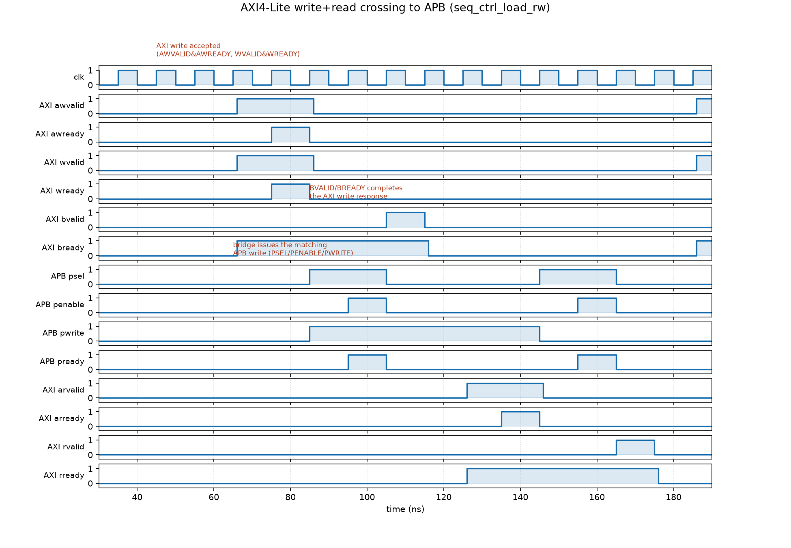

# AXI4-Lite → APB Bridge, verified with a UVM-styled environment

## What this is

An **AXI4-Lite-to-APB bridge**: a small, real SoC building block that lets a
fast system bus (AXI4-Lite) reach a simple register-mapped peripheral bus
(APB), the same role played by AMBA bridges in real SoCs connecting a CPU's
system interconnect down to low-speed peripherals. It is deliberately
bounded in scope (single-beat 32-bit transfers, one outstanding AXI
transaction at a time - no bursts, no narrow transfers, no exclusive
access) so it can be a *finished* project rather than a large, half-built
one. Behind the bridge sits an original, from-scratch APB peripheral - a
**GPT (Generic Programmable Timer)** - with a small but real register map
(plain RW, read-only status, write-1-to-clear, a read-only ID constant, and
a staged-write-while-busy hazard) so the bridge has actual protocol
semantics to get right, not just a flat memory to echo.

The bridge RTL was written from scratch for this project (not adapted from
an existing open-source core); the GPT peripheral is likewise an original
design, not modeled on any vendor's IP or register naming.

## Block diagram

```
        AXI4-Lite                          APB3
  ┌──────────────┐   awaddr/awvalid   ┌───────────────────┐   psel/penable   ┌─────────────┐
  │              │───────────────────►│                    │─────────────────►│             │
  │   AXI4-Lite  │   wdata/wvalid     │  axi4lite_apb_     │   paddr/pwrite   │  gpt_timer  │
  │   master     │───────────────────►│  bridge             │   pwdata         │  (APB       │
  │   (TB agent) │◄───────────────────│                    │◄─────────────────│   slave)    │
  │              │   bvalid/bresp     │  single-outstanding │   pready/prdata  │             │
  │              │◄───────────────────│  AXI slave <-> APB  │◄─────────────────│  CTRL/      │
  │              │   rdata/rvalid/    │  master FSM         │   pslverr        │  STATUS/    │
  │              │   rresp            │                    │                  │  LOAD/COUNT/│
  └──────────────┘                    └───────────────────┘                  │  ID          │
                                                                              └─────────────┘
   out-of-range AXI address -> bridge returns SLVERR directly, no APB txn issued
```

## GPT register map (original, from-scratch spec)

| Offset | Name   | Access   | Reset        | Fields |
|--------|--------|----------|--------------|--------|
| 0x00   | CTRL   | RW       | 0x0000_0000  | `[0] EN`, `[1] MODE` (0=one-shot,1=periodic), `[2] IE`, `[31:3]` reserved |
| 0x04   | STATUS | RO / W1C | 0x0000_0000  | `[0] BUSY` (RO), `[1] TO` (W1C), `[31:2]` reserved |
| 0x08   | LOAD   | RW       | 0x0000_0000  | reload/compare value; writes while BUSY are staged, applied at the next reload boundary |
| 0x0C   | COUNT  | RO       | 0x0000_0000  | live down-counter |
| 0x10   | ID     | RO const | 0xC0FF_EE01  | fixed peripheral ID |

Writing `CTRL.EN=1` (while not already counting) loads `COUNT` from `LOAD`
and starts decrementing once per clock. On reaching 0, `STATUS.TO` sets; in
periodic mode `COUNT` reloads and keeps counting, otherwise `BUSY` clears.
A write to `LOAD` while `BUSY=1` is staged (doesn't corrupt the in-flight
count) and inserts one APB wait state (`PREADY` deasserted for one cycle) -
the one wait-state case in this design, given real functional meaning
instead of being an arbitrary delay.

## Toolchain

Simulator: **Verilator 5.020** (Icarus Verilog was also evaluated - see
below) plus **gtkwave** for waveform viewing.

This project's verification methodology is architected like a standard UVM
environment (driver / sequencer / monitor / scoreboard / env / test,
analysis ports, factory-free but otherwise structurally the same), but does
**not** run on the real Accellera `uvm_pkg`:

- The real `uvm-core` (Accellera, IEEE 1800.2 branch) was cloned and a
  minimal `uvm_test` + `run_test()` was tried first, per the "check in five
  minutes before writing a whole testbench" rule. It fails to compile under
  Verilator 5.020 with `%Error-PKGNODECL ... uvm_phase_hopper::type_id`, a
  documented, longstanding gap in Verilator's support for forward
  references to nested parameterized classes - not something fixable by
  patching this project's code.
- Icarus Verilog 12.0 was tried as the other documented fallback. It
  rejects `virtual interface` handles declared as class members outright
  (`Invalid class item`), which is a hard blocker for any class-based
  driver/monitor - so it was ruled out for the class-based environment
  (`sim/sanity_tb.sv`, the plain class-free directed testbench used for the
  RTL-only sanity pass, does run fine on Icarus, since it never needs a
  virtual interface).
- **Verilator's own native class/OOP support** (`--timing`, needed for the
  `#1`/`@(negedge)` delays below) does handle classes, inheritance,
  parameterized classes, mailboxes, and virtual interfaces cleanly, so
  `tb/base/tb_base_pkg.sv` hand-rolls the small slice of UVM this project
  needs: `my_sequence_item`, `my_sequencer` (mailbox-based
  `get_next_item()`/`item_done()`, matching `uvm_sequencer`'s driver-facing
  API), `my_sequence` (`start_item()`/`finish_item()`), and
  `my_analysis_port`/`my_subscriber` (TLM-style broadcast). Porting this
  environment to a real `uvm_pkg` on Questa/VCS/Xcelium later is mostly a
  rename of these base classes to their `uvm_*` equivalents - the
  driver/monitor/scoreboard/sequence code above them would barely change.
- SystemVerilog `covergroup`/`coverpoint` is also not implemented by
  Verilator 5.020 (`%Error-UNSUPPORTED: covergroup`, even outside a class),
  so `tb/env/coverage.sv` is a small hand-rolled bins model instead of a
  real covergroup - the same tradeoff, documented the same way.

**A real timing/scheduling limitation worth naming plainly:** early in
building the class-based driver, a Verilator bug surfaced where a task
(class method or plain freestanding task, it doesn't matter which) that
takes a `virtual interface` as a parameter and does any nontrivial
procedural logic against its fields - the exact shape every driver/monitor
needs: drive `AWVALID`, poll `AWREADY`; or even just *read* several
handshake signals with an `if` on them - can corrupt the entire design's
combinational convergence with `%Error: Input combinational region did not
converge`, aborting the simulation. It reproduces even when the offending
class/task is never instantiated or called, and was confirmed present on
both the packaged Verilator 5.020 and a from-source build of 5.038, so it
is not a version-specific regression to wait out. Bisected down to a
two-line repro (`@(posedge vif.aclk); vif.awvalid = 1; x = vif.awready;`
inside any task taking `virtual axi_lite_if vif`) before committing to a
workaround, per the "don't burn hours patching it" guidance.

**Workaround:** `tb/interfaces/axi_lite_if.sv` and `apb_if.sv` own
`drive_write()`/`drive_read()`/`monitor_loop()`/`run_ref_model()` tasks
directly as interface methods, operating on their own signals with no
`virtual interface`-typed parameter anywhere in the call chain. The
driver/monitor classes only ever call through the virtual handle
(`vif.drive_write(...)`), never pass `vif` itself into a task parameter.
This is a slightly unusual layering (an interface knowing about
`apb_txn`/`gpt_ref_model`/`tb_base_pkg` types to do this) but it is fully
contained to those two files, clearly commented, and every test in this
project runs clean with it.

## Verification environment

```
tb/
  interfaces/        axi_lite_if.sv, apb_if.sv (+ 6 APB protocol SVA, see below)
  base/               tb_base_pkg.sv - hand-rolled UVM-styled base classes
  agents/axi_lite/    axi_txn, axi_driver, axi_monitor, axi_agent
  agents/apb/         apb_txn, apb_monitor (monitor-only: the bridge is the
                      only APB master in this system, GPT the only slave)
  env/                gpt_ref_model (behavioral GPT model, written
                      independently from the RTL, for "not just data echo"
                      checking), scoreboard, coverage, env
  seq/                directed + random sequences against the GPT register map
  tb_top.sv           top-level: DUT + interfaces + env + +TEST= test select
```

### Scoreboard

`tb/env/scoreboard.sv` checks, for every transaction:
- an in-range AXI **write** produced a matching APB write (same address,
  same data, OKAY response);
- an in-range AXI **read** was preceded by a matching APB read whose data
  made it back onto AXI unchanged;
- the APB-observed read data itself matches `gpt_ref_model` - a small
  behavioral model of the GPT's register semantics written independently
  from `rtl/gpt_timer.sv` (from the spec, not copied from the RTL), so this
  is a real functional check, not an RTL-vs-RTL echo test;
- an out-of-range AXI access got SLVERR and produced **no** APB
  transaction at all (the bridge's own decode-error path).

### Assertions (`tb/interfaces/apb_if.sv`)

Six concurrent SVA on APB protocol legality: PENABLE never asserted
without PSEL; SETUP phase always followed by ACCESS the next cycle;
address/control held stable through PREADY wait states; PWDATA held stable
through a wait-stated write; PENABLE always drops the cycle after a
completed transfer (no re-starting before the previous transfer
completes - this project's single-outstanding scope); no X on
PWRITE/PADDR/PREADY during an active access phase.

### Coverage

Hand-rolled bins (see toolchain note above) covering: each of the 5
registers hit by both read and write where applicable; one-shot vs
periodic mode both exercised; `STATUS.TO` set and cleared; the wait-state
case occurring at least once; both AXI response codes (OKAY, SLVERR)
observed.

### Tests

Directed: reset-value readback + ID constant read, CTRL/LOAD
write-then-readback, one-shot count-to-zero with `STATUS.TO`, W1C behavior
(and writing 0 is a no-op), periodic reload, `LOAD` write while `BUSY`
(wait state + staged, non-corrupting commit), bad-address SLVERR.

Random: `seq_random_mix` drives a configurable number of random legal
register accesses (read/write mix, including writes that land on `LOAD`
while a count may be in flight), checked by the same scoreboard against
`gpt_ref_model`.

## How to run

```
cd axi4lite_apb_bridge/sim
make sim                              # full directed suite + random test
make test TEST=seq_one_shot_timeout   # one named test
make waves TEST=seq_ctrl_load_rw      # VCD dump for viewing/screenshots
gtkwave waves.vcd
```

`make sanity` / `make skeleton` rerun the stage-1 (plain, class-free RTL
sanity check) and stage-2 (minimal base-package handshake) checks that were
used to validate the toolchain before the full environment was built.

## Waveform

`docs/waveform.png` (generated from `make waves`'s `waves.vcd` via
`sim/plot_waves.py` - there's no X server in this environment for an
interactive gtkwave screenshot, so the VCD is rendered and annotated
directly) shows one full AXI4-Lite write and one read from
`seq_ctrl_load_rw`, crossing to APB and back:



Left to right: `AWVALID`/`WVALID` are accepted by the bridge, which then
runs a matching APB `PSEL`/`PENABLE`/`PWRITE` transfer against the GPT
timer and completes the AXI write with `BVALID`/`BREADY`; the same shape
repeats for the read, with `PREADY`'s data coming back out on `RVALID`.

## What a production version would add

Honestly out of scope here, not pretended to exist:

- **AXI4-Lite burst support** and multiple-outstanding transactions instead
  of this project's single-beat, single-outstanding scope.
- **A second, equally original peripheral** (e.g. a small GPIO block)
  behind the bridge, to exercise address decode/routing across multiple
  targets rather than protocol conversion to a single one.
- **A UVM register model (RAL)** generated from the GPT's register map -
  a natural, recognizable next step and a clean formal description of the
  MMR beyond the markdown table above.
- **A real `uvm_pkg` run** (Questa/VCS/Xcelium, or a future Verilator that
  fixes the compatibility gaps above) to validate this environment's
  architecture against the genuine Accellera library, not just this
  project's own base-class stand-ins.
- Exported machine-readable coverage reports rather than the current
  `$display`-based summary.
